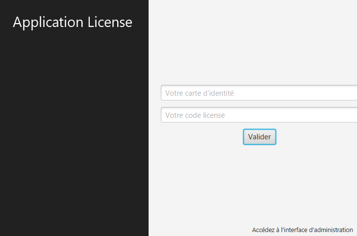
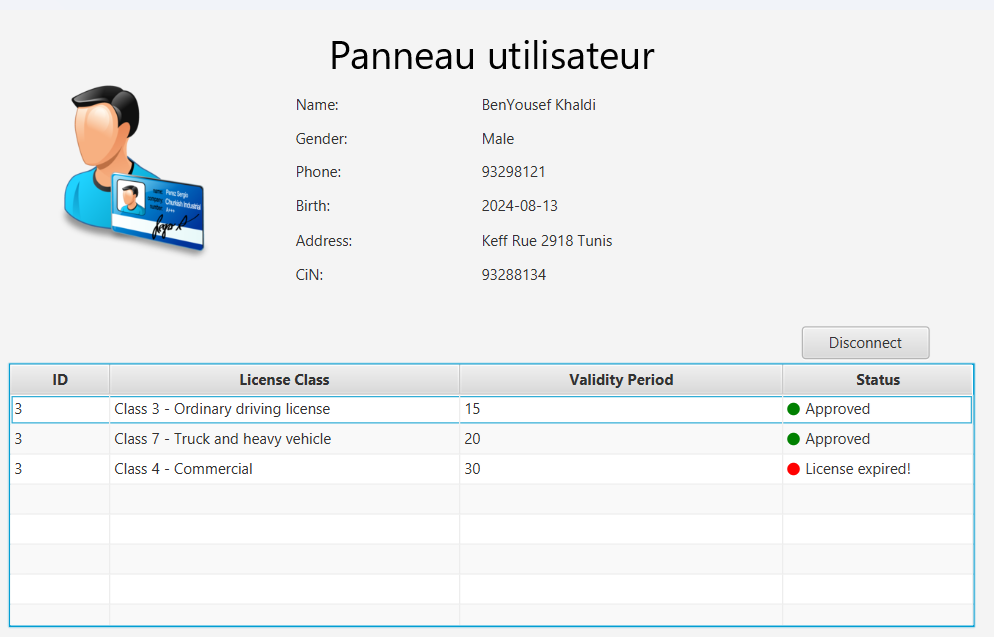

# Driving License Application System

This project is a Driving License Application System built using Java and JavaFX. It allows users to apply for driving licenses, and administrators to manage applications and user data.

## Table of Contents

- [Overview](#overview)
- [Features](#features)
- [Setup](#setup)
- [Usage](#usage)
- [Project Structure](#project-structure)
- [Screenshots](#screenshots)

## Overview

The Driving License Application System is designed to streamline the process of applying for and managing driving licenses. It includes functionalities for users to submit applications and for administrators to review and manage these applications.

## Features

- User registration and login
- Admin login and management interface
- Application submission and status tracking
- Personal information management
- License data display

## Setup

### Prerequisites

- Java Development Kit (JDK) 17 or higher
- MySQL database ( 8.0.39 )

### Installation

1. Clone the repository:
    ```sh
    git clone https://github.com/yourusername/yourrepository.git
    cd yourrepository
    ```

2. Set up the MySQL database:
    - Create a database named `licenses`.
    - Import the provided SQL script to create the necessary tables.

3. Update the database connection details in `src/DatabaseConnection.java`:
    ```java
    private static final String URL = "jdbc:mysql://localhost:3314/licenses";
    private static final String USER = "root";
    private static final String PASSWORD = "root";
    ```

4. Build and run the project using your preferred IDE or command line.

## Usage

### User Interface

1. **Login**: Users can log in using their credentials.
2. **Admin Interface**: Admins can log in to access the management interface.
3. **Application Submission**: Users can submit new applications for driving licenses.
4. **Personal Information**: Users can update their personal information.

### Admin Interface

1. **Review Applications**: Admins can review and manage user applications.
2. **Manage Users**: Admins can view and update user information.

## Project Structure

```
├── src/
│   ├── AdminController.java
│   ├── ControllerClass.java
│   ├── DatabaseConnection.java
│   ├── LicenseController.java
│   ├── NewApplicationController.java
│   ├── NewLicenseController.java
│   ├── interface.fxml
│   ├── license.fxml
│   ├── new_application.fxml
│   ├── new_license.fxml
│   ├── admin_interface.fxml
│   └── imgs/
│       ├── user.png
│       ├── veh.png
│       └── reload.png
```


### Main Components

- **AdminController.java**: Handles admin-specific functionalities.
- **ControllerClass.java**: Manages the main application logic and user interactions.
- **DatabaseConnection.java**: Manages database connections and queries.
- **LicenseController.java**: Displays license data and handles user interactions related to licenses.
- **NewApplicationController.java**: Manages the submission of new applications.

### FXML Files

- **interface.fxml**: Main interface layout.
- **license.fxml**: Layout for displaying license data.
- **new_application.fxml**: Layout for submitting new applications.
- **new_license.fxml**: Layout for managing new licenses.

## Screenshots

### Main Interface


### Admin Interface


### User Interface


### Application Submission


## License

This project is licensed under the MIT License. See the [LICENSE](LICENSE) file for details.
